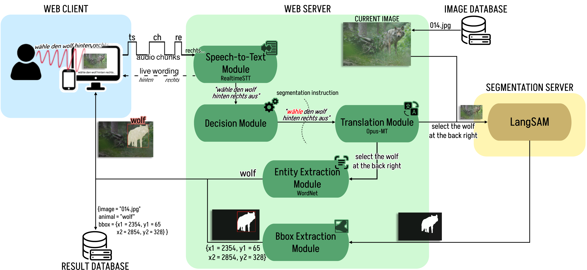

# Voice-Controlled Annotation of Wildlife Images: Evaluation of Machine Learning Models as an Alternative to Manual Bounding Box Creation
*Darmstadt University of Applied Sciences*

* Bachelor’s Thesis, Final Grade: 1.0

**Abstract**

This thesis focuses on the development and evaluation of a voice-controlled tool for image annotation within the WildLIVE project, which collects wildlife images from regions such as South Africa and Bolivia. The large volume of automatically captured images requires an efficient and accessible method to determine which animal species are depicted and where they are located. Traditionally, this is done by manually drawing so-called bounding boxes and selecting the species from a catalog. However, this annotation method is highly time-consuming, especially when dealing with several thousand images.
As an alternative, this thesis presents a pipeline that combines modern speech-to-text and text-to-object recognition models. This approach aims to be not only faster but also more accessible to different user groups. In a comparative study with volunteers, the voice-based annotation method was evaluated against the manual approach. The results show that the voice-based method is a promising alternative that can save time without incurring significant losses in accuracy.

#### Info
This repository serves as a storage for the wildlife images used in my bachelor's thesis.
